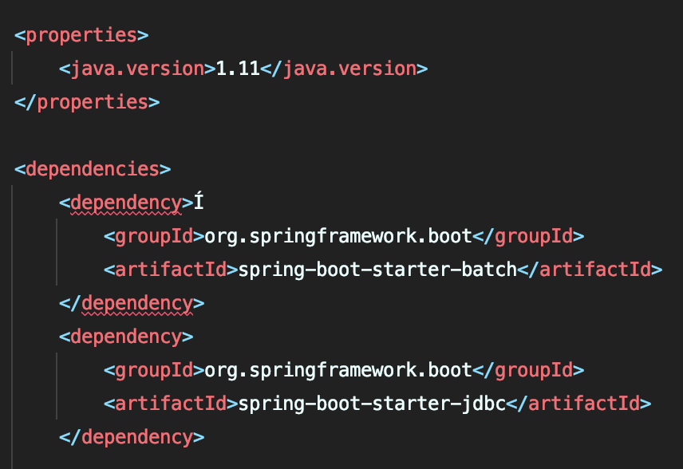
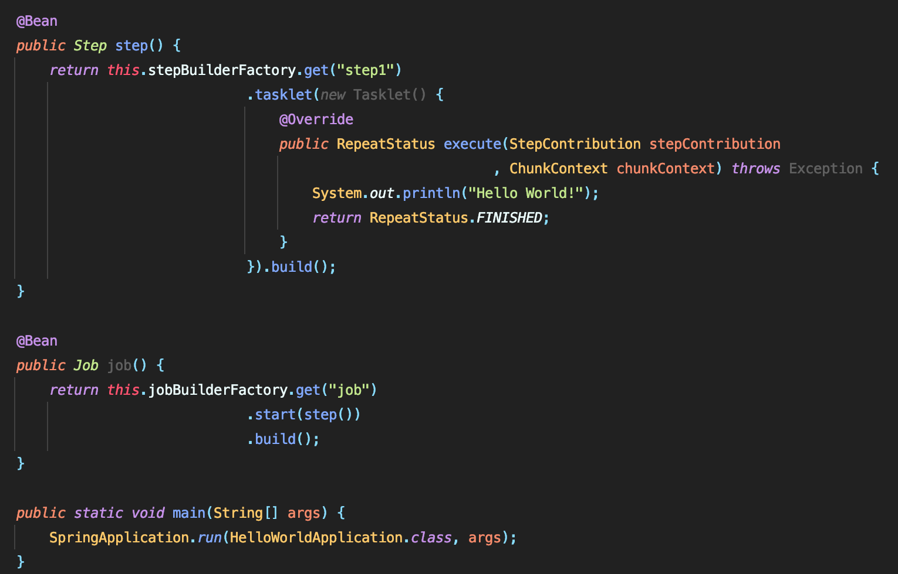
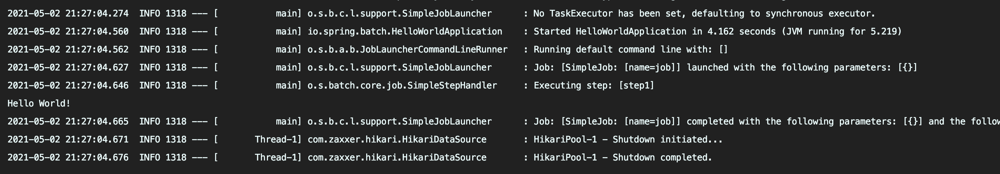

# sprinig batch

---

스프링 배치를 공부하는 환경에는 자바 11 버전꽈 spring-batch 및 아직은 사용하지는 않지만 jdbc 라이브러리를 추가하였다.
 

java나 C 같은 언어를 처음 시작할 때, Hello World로 시작하는 것 처럼 Spring-batch도 이렇게 시작하겠습니다.
 

콘솔에 보면 Hello World! 가 찍히는것을 볼 수 있다.