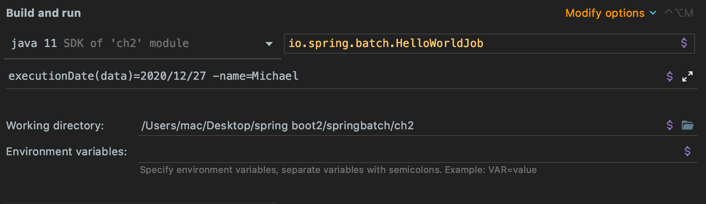
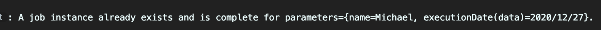
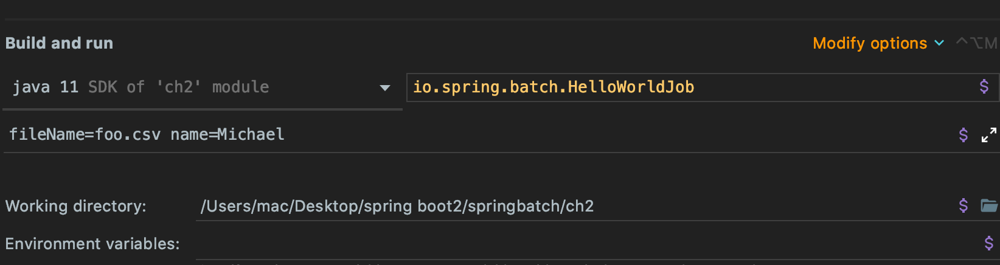
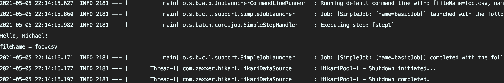

# springBatch

---

spring Batch 를 공부하기 위해서는 springboot를 시작하기 앞서 parameter를 arugument로 주어 그 변수를 사용할 수 있음을 알고 있어야 한다.



위 처럼 springboot 를 시작전에 configuration에서 매개변수를 줄 수 있다.
시작하게 되면 name 매개변수를 내뱉는다.

<br>

하지만 springBatch를 하게 되면 여러가지 springBatch Table이 연결된 데이터베이스에 생긴다.
거기서 중복된 파라미터가 있는지 판단하여 한번 더 실행이 된것인지 판단하게 되어 한번 실행된 것을 방지 할 수 있다.



위 처럼 에러 메시지가 나온다.

<br>

다음 예제는 resource 에 있는 파일이 .csv파일인지 확인하는 예제이다.

```
!StringUtils.hasText(fileName)
!StringUtils.endsWithIgnoreCase(fileName, "csv")
```

`jobParametersValidator`의 validate를 재정의하여 .csv와 파일인지를 확인하는 작업을 한 후,



위 처럼 fileName를 추가하여 시작해준다.
<br>



위처럼 result 값이 name 과, filename를 출력한다.